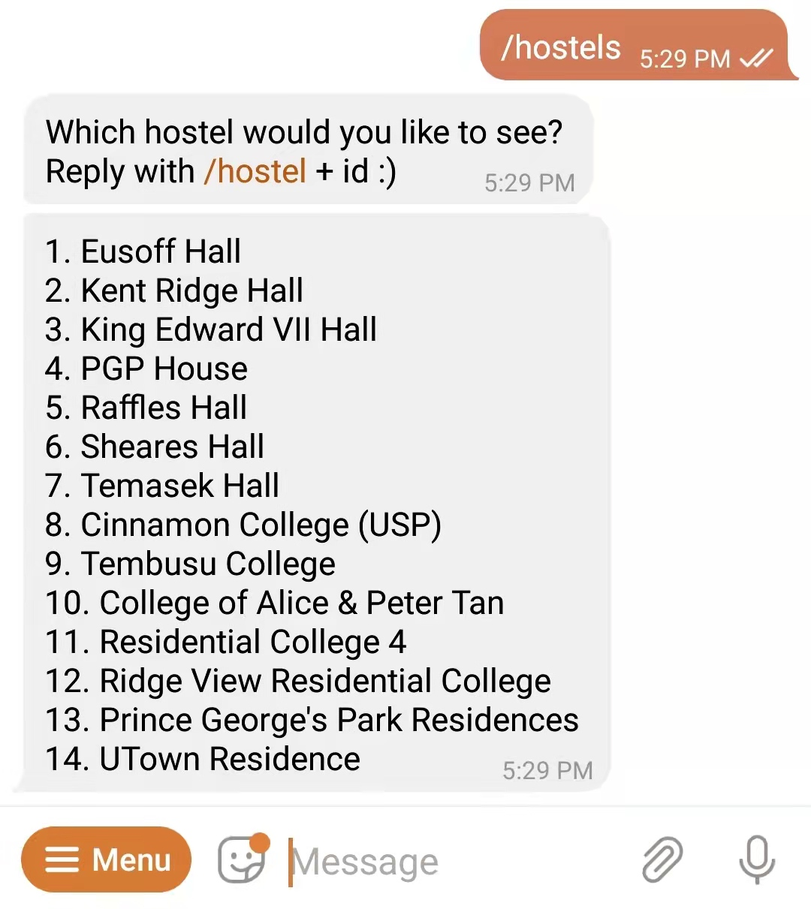
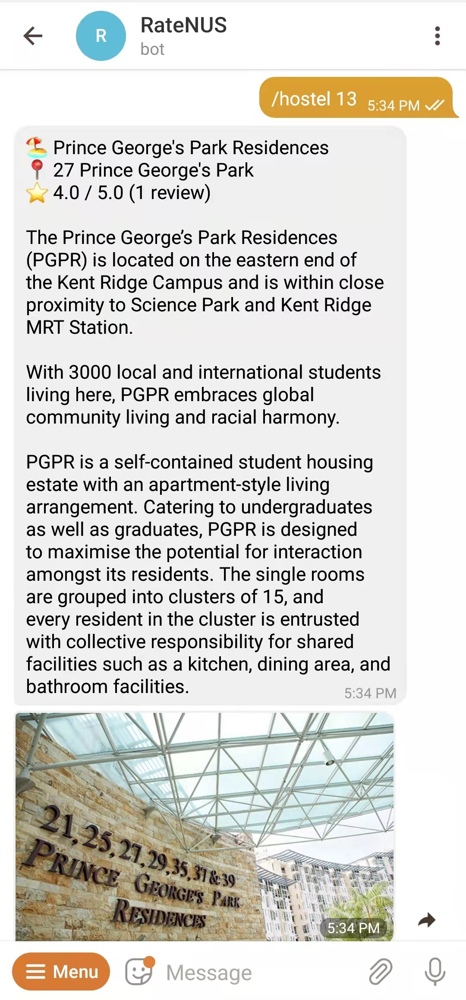
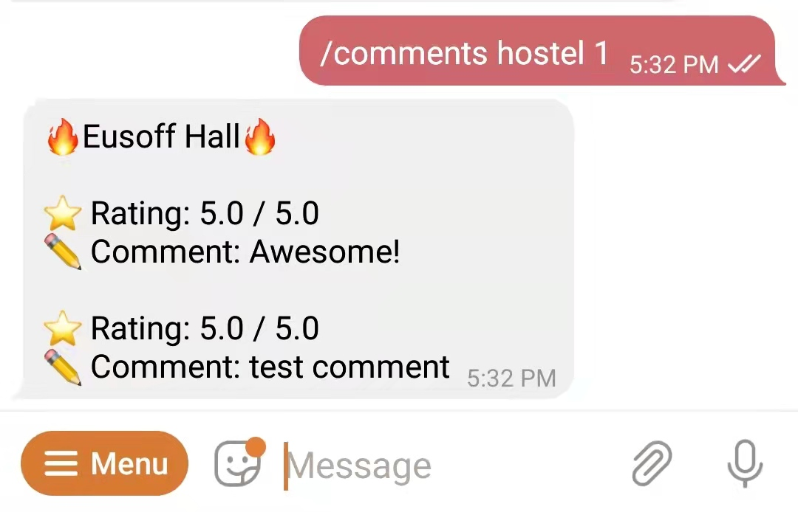

# RateNUS Telegram Bot
A [Telegram bot](https://t.me/RateNUSBot) that retrieves data from RateNUS website [here](https://ratenus.com)

## Features 

#### `/hostels` 
view a list of hostels in NUS

#### `/hostel [id]` 
view a hostel's information

#### Similar commands for 
- `/foods` 
- `/food [id]`
- `/studyAreas`
- `/studyArea [id]`

#### `/comments hostel/food/studyArea [id]`
View comments of a certain type

